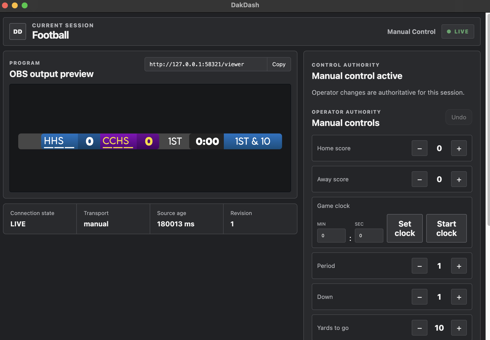

# Daktronics Dash

Daktronics Dash is a simple Flask based tool for broadcasting sports scores.
It supports manual scoring through a web UI and can sync with a Daktronics
controller via an ESP32.

<!--
Screenshot slot: Operator console
Capture the complete application window with representative teams, scores, and
a LIVE connection state. Use a wide crop and hide personal or venue-specific data.
Save the image as docs/images/operator-console.png, then replace this comment with:



_Configure the scoreboard, connection, and broadcast appearance from one console._
-->

## Live score transport

DakDash receives the Daktronics serial feed at 19,200 baud through an ESP32. The
device frames the incoming data, retains the newest complete payload, and relays
it to the desktop application over TCP port `1234`, where sport-specific parsing
and scoreboard state updates occur.

<!--
Screenshot slot: ESP32 hardware setup
Photograph the ESP32, serial connection, Ethernet connection, and scoreboard
controller together. Use a clean background and keep credentials and venue network
details out of frame. Save the image as docs/images/esp32-hardware.png, then replace
this comment with:


_The ESP32 bridges the Daktronics serial feed to DakDash over the local network._
-->

## Running

```bash
python3 -m venv .venv
source .venv/bin/activate
pip install -r requirements.txt
python main.py
```

Then open `http://127.0.0.1:5000/` in your browser.

## Development

Scoreboards live in `scoreboard_svgs/` and their preferences are stored in
`scoreboard_svgs/scoreboard_preferences.json`.

The `static/js` folder contains the wizard logic and manual scoring handlers.

### Electron operator console

The Electron application runs the React operator console and the Flask API as
one local application. It keeps the OBS viewer available at:

```text
http://127.0.0.1:58321/viewer
```

<!--
Screenshot slot: OBS scoreboard output
Capture the clean scoreboard graphic over representative video or a neutral preview.
Hide browser controls and use a 16:9 crop. Save the image as
docs/images/obs-scoreboard.png, then replace this comment with:


_Use the dedicated viewer URL as a browser source in OBS._
-->

Run an unpackaged development build with:

```bash
cd desktop
npm ci
npm run electron:dev
```

Appearance preferences are stored in the current macOS user's Electron app-data
directory. Connection IP, port, and device ID continue to be entered by the
operator and persisted locally; no venue values are compiled into the app.

## Building the universal macOS app

The release build requires Xcode command-line tools, Node 22, plus native Python
interpreters for both Apple Silicon and Intel. The defaults on the build Mac are
`/opt/homebrew/opt/node@22/bin` for Node, `/opt/homebrew/bin/python3` for arm64, and
`/Library/Frameworks/Python.framework/Versions/3.9/bin/python3` for x64. Override
them with `DAKDASH_NODE_BIN_PATH`, `DAKDASH_PYTHON_ARM64`, and
`DAKDASH_PYTHON_X64` when needed.

```bash
./scripts/build_macos_universal.sh
```

The command produces `release/DakDash-macos-universal.zip`. The bundle contains
both backend architectures and does not require Python, Node.js, or Rosetta on
the destination Mac.

This internal build is ad-hoc signed but not Developer ID signed or notarized.
After downloading it, the operator must extract it, right-click `DakDash.app`,
choose **Open**, and confirm the first launch. Automatic updates are intentionally
not enabled for this unsigned distribution. The current build targets macOS 12
or newer.
